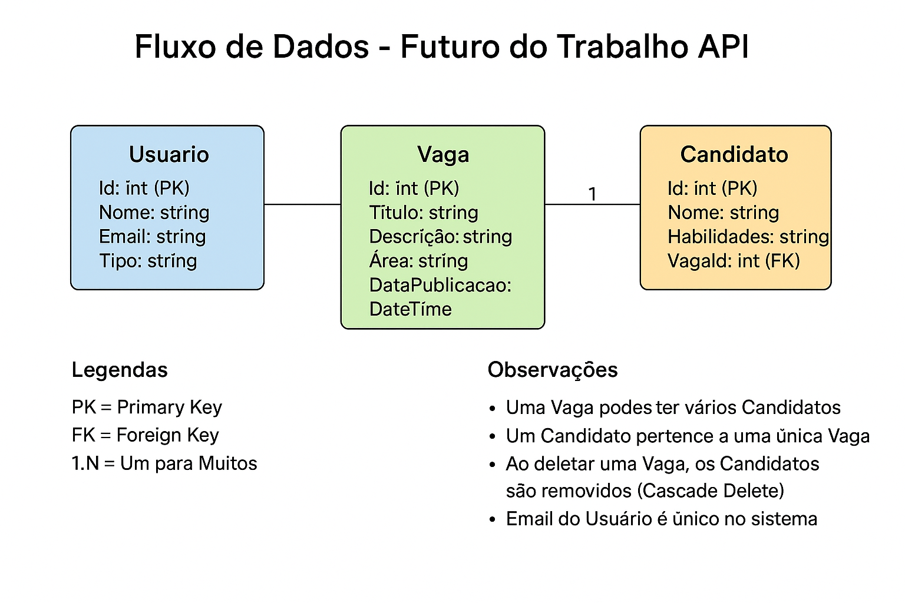

# 🧠 Futuro do Trabalho - API C#

## 👥 Integrantes do Grupo

- **Pedro Moura Barros** – RM550260  
- **Rodrigo Fernandes dos Santos** – RM98896

---

## 🚀 Descrição do Projeto

Este projeto faz parte da **Global Solution FIAP 2025** e foi desenvolvido como uma solução tecnológica voltada ao tema **“O Futuro do Trabalho”**.

A API tem como objetivo **conectar profissionais às novas oportunidades do mercado digital**, permitindo que **recrutadores publiquem vagas** e que **candidatos se inscrevam nelas**, apresentando suas habilidades técnicas.

Ela resolve um desafio real: o mercado de trabalho está evoluindo rapidamente com a transformação digital — e essa solução facilita a integração entre empresas e talentos preparados para as profissões do futuro.

---

## ⚙️ Funcionalidades

A API oferece operações CRUD completas para três entidades principais:

### 👤 Usuários (`/api/v1/Usuarios`)
- **GET** `/api/v1/Usuarios` — Lista todos os usuários cadastrados  
- **GET** `/api/v1/Usuarios/{id}` — Retorna um usuário específico  
- **POST** `/api/v1/Usuarios` — Cria um novo usuário (ex: Recrutador)  
- **PUT** `/api/v1/Usuarios/{id}` — Atualiza um usuário existente  
- **DELETE** `/api/v1/Usuarios/{id}` — Remove um usuário  

### 💼 Vagas (`/api/v1/Vagas`)
- **GET** `/api/v1/Vagas` — Lista todas as vagas com seus candidatos  
- **GET** `/api/v1/Vagas/{id}` — Retorna uma vaga específica  
- **POST** `/api/v1/Vagas` — Cria uma nova vaga  
- **PUT** `/api/v1/Vagas/{id}` — Atualiza uma vaga existente  
- **DELETE** `/api/v1/Vagas/{id}` — Remove uma vaga e seus candidatos  

### 👨‍💻 Candidatos (`/api/v1/Candidatos`)
- **GET** `/api/v1/Candidatos` — Lista todos os candidatos  
- **GET** `/api/v1/Candidatos/{id}` — Retorna um candidato específico  
- **GET** `/api/v1/Candidatos/vaga/{vagaId}` — Candidatos de uma vaga  
- **POST** `/api/v1/Candidatos` — Registra um novo candidato  
- **PUT** `/api/v1/Candidatos/{id}` — Atualiza dados de um candidato  
- **DELETE** `/api/v1/Candidatos/{id}` — Remove um candidato  

---

## 🧩 Forma de Funcionamento

### 🧰 Pré-requisitos
- .NET 8.0 SDK  
- Visual Studio 2022 / VS Code  

### ▶️ Execução

1. Clone o repositório:
   ```bash
   git clone https://github.com/pedromourabarros/GS_C_SHARP.git
   ```
2. Entre na pasta:
   ```bash
   cd FuturoDoTrabalho.API
   ```
3. Restaure as dependências:
   ```bash
   dotnet restore
   ```
4. Rode a aplicação:
   ```bash
   dotnet run
   ```
5. Acesse no navegador:  
   👉 `https://localhost:5001/swagger`  
   ou  
   👉 `http://localhost:5000/swagger`

---

## 🗄️ Banco de Dados

O projeto usa **SQLite**, criado automaticamente na primeira execução.  
O arquivo `FuturoDoTrabalho.db` é gerado na pasta raiz.

> ⚠️ O `.db` está no `.gitignore` — cada dev tem seu banco local.

---

## 🔄 Fluxo de Dados

O diagrama abaixo mostra a relação entre as entidades do sistema:



### 🧱 Estrutura das Entidades

#### 🧍‍♂️ Usuario
- Id  
- Nome  
- Email (único)  
- Tipo (ex: Recrutador/Admin)

#### 💼 Vaga
- Id  
- Título  
- Descrição  
- Área  
- DataPublicacao  
- **Relacionamento:** 1 vaga → vários candidatos

#### 👨‍💻 Candidato
- Id  
- Nome  
- Habilidades  
- VagaId  
- **Relacionamento:** cada candidato pertence a uma vaga

---

## 📘 Documentação Swagger

A API possui documentação interativa via **Swagger UI**:  
🔗 `https://localhost:5001/swagger` ou `http://localhost:5000/swagger`

Lá você pode:
- Ver todos os endpoints  
- Testar requisições diretamente  
- Visualizar modelos e respostas em tempo real  

---

## ▶️ Exemplo Rápido no Swagger

1. Acesse `POST /api/v1/Usuarios`
2. Clique em **Try it out**
3. Envie o JSON:
   ```json
   {
     "nome": "João Silva",
     "email": "joao@empresa.com",
     "tipo": "Recrutador"
   }
   ```
4. Clique em **Execute**  
✅ Resultado: Status `201 Created`

---

## 🎥 Vídeo de Demonstração

[🎬 Assista ao vídeo no YouTube](https://youtu.be/5_N0rsl_7rM)

> Demonstração completa da API em funcionamento, testando todos os endpoints no Swagger.  
> Duração: ~5 minutos.

---

## 📁 Estrutura do Projeto

```
FuturoDoTrabalho.API/
├── Controllers/
│   └── V1/
│       ├── UsuariosController.cs
│       ├── VagasController.cs
│       └── CandidatosController.cs
├── Data/
│   └── ApplicationDbContext.cs
├── DTOs/
│   ├── UsuarioDTO.cs
│   ├── VagaDTO.cs
│   └── CandidatoDTO.cs
├── Models/
│   ├── Usuario.cs
│   ├── Vaga.cs
│   └── Candidato.cs
├── images/
│   └── fluxo-de-dados.png
├── Program.cs
├── appsettings.json
└── FuturoDoTrabalho.API.csproj
```

---

## 🛠️ Tecnologias Utilizadas

| Tecnologia | Função |
|-------------|--------|
| **ASP.NET Core 8.0** | Framework principal da API |
| **Entity Framework Core 8.0** | ORM para o banco de dados |
| **SQLite** | Banco relacional leve |
| **Swagger / OpenAPI** | Documentação interativa |
| **C#** | Linguagem de programação |

---

## ✅ Boas Práticas Implementadas

- API RESTful estruturada  
- Versionamento (`/api/v1/`)  
- Status codes corretos (200, 201, 400, 404, etc.)  
- DTOs para transferência de dados  
- Relacionamentos e **Cascade Delete**  
- Documentação detalhada com **Swagger**  
- Validações básicas implementadas  

---

## 🔬 Passos de Teste (Resumo)

1. Criar Usuário → `POST /api/v1/Usuarios`  
2. Criar Vaga → `POST /api/v1/Vagas`  
3. Criar Candidato → `POST /api/v1/Candidatos`  
4. Listar tudo → `GET /api/v1/Vagas` e `GET /api/v1/Candidatos`  
5. Atualizar / Deletar e validar respostas no Swagger  

---

## 🌟 Melhorias Futuras

- Autenticação e autorização (JWT)  
- Paginação e filtros avançados  
- Upload de currículos  
- Sistema de notificações  
- Avaliação de candidatos  
- Relatórios e métricas  

---

**Desenvolvido para Global Solution FIAP 2025**  
*Conectando profissionais ao futuro do trabalho*
